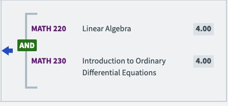
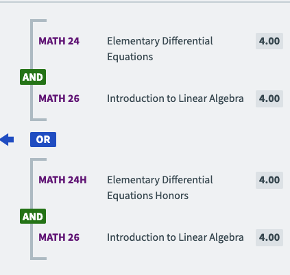
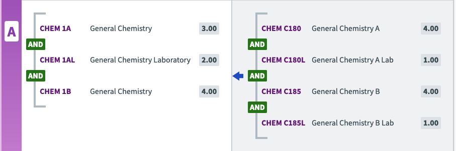

# Scraping

This doc will detail how the assist webpage is formatted to understand how to scrape it.

**Note:** This doc will mostly cover articulation for specific classes and not articulation for specific majors (i.e what classes are required for specific majors).

There is example html in the `example_html` folder for this [site](https://assist.org/transfer/results?year=75&institution=79&agreement=124&agreementType=from&viewAgreementsOptions=true&view=agreement&viewBy=major&viewSendingAgreements=false&viewByKey=75%2F124%2Fto%2F79%2FMajor%2F23d79a84-d16c-4b58-7dee-08dcb87d5deb), and others which can be used as a reference; the html is formatted and edited to be easier to read. There are also comments pointing out relevant sections of code.

This guide is as of June 2025.

## Quick Aside on Formatting

- Many divs have one unique class, and we will use this class to define and name that div, and it might be referred to by the name of the class.
- The syntax `{X} -> {Y}` defines a nested expression and simply means: "Y contained in X".

## How are articulations for classes defined?

On each page the articulation for each class is wrapped in a div with the class `articRow` (`rowContent` defines a larger section of rows with multiple different class articulations).

From there we can break down the div into three different divs which have the following classes: `rowReceiving`, `rowDirection`, and `rowSending`. From now on we will refer to these divs by their respective class name.

### `rowReceiving` div

This defines the details of a class at the target school (non-CC).

As of right now it only contains the div with class `courseLine` which contains the following divs defined by their unique classes:

- `prefixCourseNumber`, the text this div wraps, as the name implies, defines the course number (ex MATH 1B).
- `courseTitle`, the text this div wraps gives the general course title although it might not be super detailed (Ex: Calculus (however this is used for both Calc 1 and Calc 2 for Berk)).
- `courseUnits`, the text this div wraps are the number of units for the course. (Ex: 4.00), it also contains a hidden span with the class `visually-hidden` that contains the word "units".

In terms of [conjunctions](#conjunctions) it works the same as `rowSending` (from the base class down however these differ (`rowSending` has two extra layers before it starts)).

For general education/breadth agreements, `rowReceiving` contains only the div with class `requirementOrGEArea` which itself only contains a div with class `content`. this div contains the following two divs with unique classes:

- `geAreaCode`, div containing a two letter code representing the corresponding education/breadth requirement. it is formatted as a string with leading and trailing whitespace (ex. " QR " for Quantitative Reasoning).
- `courseTitle`, the text this div wraps provides the two letter code of the requirement and its full title, which are separated only by a single hyphen (ex. QR-Quantitative Reasoning). 

### `rowDirection` div

Don't fully understand the purpose of this div, but it displays an arrow from either the source to target or vice versa for that specific class.

### `rowSending` div

This defines the possible ways to take classes at the source school to articulate for the target school's class.

The whole thing is wrapped in a `awc-articulation-sending` element (not div), except when there are no courses to be articulated. **If that is the case the text "No Course Articulated" will appear wrapped in a p tag.** (add more if possible)

The main content is in the div with the `view_sending__content` class which defines the following divs, again defined by their unique classes:

- `courseLine`, refer to [`rowReceiving`](#rowreceiving-div), it's the same one.
- `awc-view-conjunction` refer to the discussion on [conjunctions](#conjunctions) below.

## Attributes

Sometimes assist will leave messages on a particular course aggreement for more info. A detailed list of all list has not been created (TODO), but they share some commonalties.

First off they all seem to be wrapped in a div with the class `attribute -> attributeContent -> attributeContainer` the message is then just wrapped in this series of divs. The message seems to be applied on the same level as a group of class(es) it corresponds too (so either just a single course or an and clause)

List of Attributes (so far):

    - "This course must be taken at the university after transfer", I'm assuming this means no course at any school will articulate, this is different from "No Course Articulated" as that is specific for the specific school and doesn't rule out the fact that other schools might have classes that articulate.
    - "Must complete an additional university course after transfer to satisfy this requirement", this means that part of the course is accepted but part of it needs to be taken as a bridge course
    - "Same as {X}, {Y}, {Z}", this indicates that on the course is crosslisted as different courses at that institution

## Conjunctions

Conjunctions define a set of multiple classes that can be taken to fulfill a course. This can either mean multiple classes must be taken to fully articulate or there are multiple options, or both.

**Note:** Section still a work in progress, so far only defines with one conjunction (not nested)

### Brackets

Brackets are common for "and" conjunctions when defining a set of classes that must be taken to articulate the course.

Below is an example of the rendered html of a bracket:

#### How are they defined in HTML?

The whole content of a bracket will be contained in a div with the class `bracketWrapper` (This might make it easier to scrape ands as the classes are all defined within this div) and it will contain the following items:

    - `bracketTop`, simply defines the top of the bracket
    - `bracketContent`, this is the section we are interested in and it defines all the classes needed, since brackets only show up in and blocks (as of our understanding right now) it will contain the `courseLine` divs in addition to the [`awc-view-conjunction`](#awc-view-conjunction)
    - `bracketBottom`, simply defines the end of the bracket
    - **Note:** there may be other divs that give more information that might be important like if any bridge courses need to be taken. These divs should be explored further in the future (TODO)

### `awc-view-conjunction`

These appear to be the main way to define conjunctions and usually appear right after the `courseLine` div followed by another `courseLine` div.

They contain the following things:

- div with class `conjunction` it then also either contains an `or` class or an `and` class depending on the type of conjunction it then also wraps the text "or" or "and". This (inner div) will also have a class of either "standAlone" or "series" which will match the "cssclass" tag of the actual `awc-view-conjunction`. My best guess is that they indicate whether or not its part of a bracket and the sign interrupts the bracket or whether its not part of a bracket. The image below contains both:

### Examples

The following examples are using `rowSending` however `rowReceiving` is equally valid.

#### Single or layout

`rowSending -> view_sending__content` then within that we have `courseLine` for the first option `awc-view-conjunction` with an `or` class and then another `courseLine` for the second option

#### Single and layout

`rowSending -> view_sending__content -> bracketWrapper` then within that we have `bracketTop` then `bracketContent` (which looks simlar to the [Single or layout](#single-or-layout) except the `awc-view-conjunction` is with an and) and finally `bracketBottom`

#### Multiple ands

Example:

This is pretty straitforward. It is the same as with a [single and](#single-and-layout) however after the second class within `bracketContent` there will be another `awc-view-conjunction`, and so on until the end.

#### Two and classes joined by an or

Example:

By now we will see the pattern.

We start by entering the `rowSending -> view_sending__content` next we will define a bracket as described above with our bracket content. Then an `awc-view-conjunction` with the "or" class and containing "or" as text. Then another bracket with the other set of classes.

## TODO

Investigate these cases:

- [x] [Multiple "and"s stacked](https://assist.org/transfer/results?year=75&institution=79&agreement=105&agreementType=from&viewAgreementsOptions=true&view=agreement&viewBy=major&viewSendingAgreements=false&viewByKey=75%2F105%2Fto%2F79%2FMajor%2F3600bdbe-e56c-4bb8-7e00-08dcb87d5deb)
- [x] [Single and](https://assist.org/transfer/results?year=75&institution=79&agreement=121&agreementType=from&viewAgreementsOptions=true&view=agreement&viewBy=major&viewSendingAgreements=false&viewByKey=75%2F121%2Fto%2F79%2FMajor%2F6419da5a-b4fd-4922-7ddb-08dcb87d5deb)
- [x] Cases where there is extra information about a class such as if it has to be taken as a bridge course in addition other cases of addtional info exist for example in the [IVC to Berk (Analytics)](https://assist.org/transfer/results?year=75&institution=79&agreement=124&agreementType=from&viewAgreementsOptions=true&view=agreement&viewBy=major&viewSendingAgreements=false&viewByKey=75%2F124%2Fto%2F79%2FMajor%2F23d79a84-d16c-4b58-7dee-08dcb87d5deb) with the "Regular and honors courses may be combined to complete this series"
- [x] Articulate multiple classes
